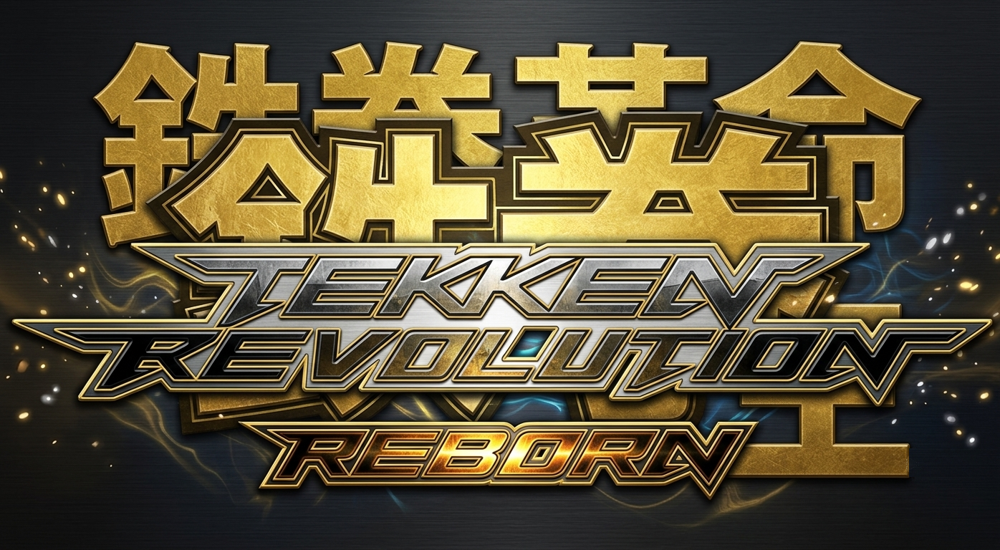

[](https://github.com/RobertoTorino/rpcs3-trr/actions/workflows/release-package.yml) [](https://github.com/RobertoTorino/rpcs3-trr/actions/workflows/nightly-develop.yml)

# RPCS3 Tekken Revolution Reborn Build Guide

This repository currently contains two Windows build trees:

1. `build` - regular/reference build tree. Keep this as-is.
2. `build-trr-release` - active Tekken Revolution Reborn build tree.

Reference build version: `RPCS3 0.0.13-11450-43c87e99 Alpha`.

For historical upstream notes, see `README_0.0.13.md` and `BUILDING_0.0.13.md`.



## Environment (Windows 10/11)

Install:

* Visual Studio 2022 with Desktop development with C++
* CMake (in `PATH`)
* PowerShell 5+ (or PowerShell 7)
* Python (in `PATH`)
* Qt 6.11.1 (`msvc2022_64`)
* Vulkan SDK ([install guide](https://vulkan.lunarg.com/doc/sdk/latest/windows/getting_started.html))
* LLVM 11:
  * Either source tree under `llvm/` (contains `CMakeLists.txt`), or
  * Prebuilt LLVM 11 with `LLVMConfig.cmake` available via `LLVM_DIR`

## Primary Build Workflow (build-trr-release)

From repository root, run:

```powershell
powershell -NoProfile -ExecutionPolicy Bypass -File .\scripts\quick_build_rpcs3.ps1 -BuildDir .\build-trr-release -Clean
```

What this does:

1. Detects Visual Studio generator/toolchain.
2. Resolves Vulkan SDK and Qt.
3. Resolves LLVM 11 source/prebuilt configuration.
4. Configures and builds target `rpcs3`.
5. Writes logs to `build-trr-release\build-logs\`.

Output binary:

* `build-trr-release\bin\rpcs3.exe`

Optional deploy step for Qt runtime files:

```powershell
powershell -NoProfile -ExecutionPolicy Bypass -File .\scripts\quick_build_rpcs3.ps1 -BuildDir .\build-trr-release -DeployQt
```

If LLVM is not auto-detected, pass it explicitly:

```powershell
powershell -NoProfile -ExecutionPolicy Bypass -File .\scripts\quick_build_rpcs3.ps1 -BuildDir .\build-trr-release -LLVMDir "C:\path\to\lib\cmake\llvm"
```

## Script Entry Points

All maintained build automation lives in `scripts/`:

* `scripts/quick_build_rpcs3.ps1` - configure + build (recommended)
* `scripts/configure_rpcs3.ps1` - configure only
* `scripts/build_rpcs3_binary.ps1` - build only (configured tree required)
* `scripts/clean_rpcs3_build.ps1` - remove build directory

Examples:

```powershell
# Configure only
powershell -NoProfile -ExecutionPolicy Bypass -File .\scripts\configure_rpcs3.ps1 -BuildDir build-trr-release

# Build only
powershell -NoProfile -ExecutionPolicy Bypass -File .\scripts\build_rpcs3_binary.ps1 -BuildDir build-trr-release

# Clean build tree
powershell -NoProfile -ExecutionPolicy Bypass -File .\scripts\clean_rpcs3_build.ps1 -BuildDir build-trr-release
```

## Release Tag Convention

Use this lightweight promote-tag format for release builds:

* `trr-vYYYY.MM.DD.N`

Where:

1. `YYYY` = 4-digit year
2. `MM` = 2-digit month
3. `DD` = 2-digit day
4. `N` = same-day release increment starting at `1`

Examples:

* `trr-v2026.07.28.1`
* `trr-v2026.07.28.2`
* `trr-v2026.08.03.1`

Notes:

1. Keep tags immutable after push (create a new increment instead of force-moving an existing tag).
2. This repository's GitHub release workflow is triggered by tags matching `trr-v*`.
3. Prefer tagging from `main` when promoting a validated release commit.

## Legacy/Reference Build Tree

`build` is retained as the regular/reference build for `RPCS3 0.0.13-11450-43c87e99 Alpha`.

Do not delete or repurpose `build` unless you intentionally want to recreate that tree.